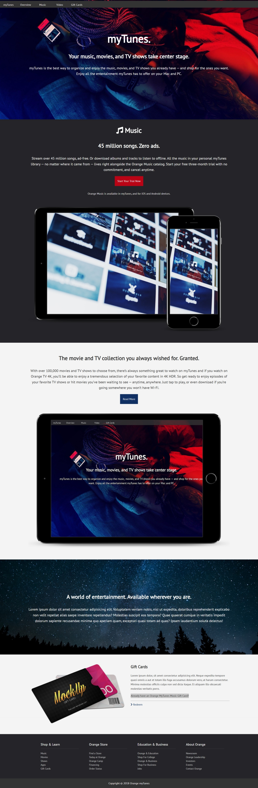
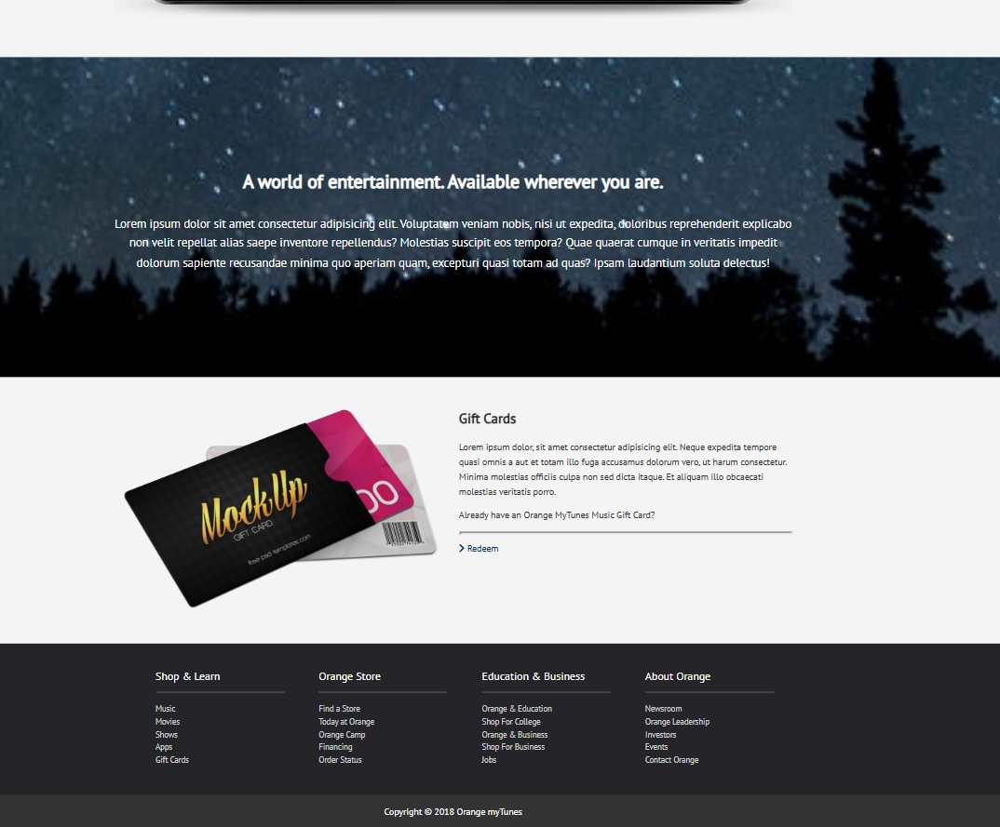

# MyTunes Landing Page

A responsive music streaming landing page built using HTML, CSS, and a little jQuery.  
The project features a modern UI, smooth layout, and responsive design inspired by music streaming platforms.

## Features

- Responsive design
- Modern landing page UI
- Smooth scrolling/navigation
- Simple jQuery interactions
- Clean and structured layout

## Technologies Used

- HTML5
- CSS3
- jQuery

## Preview

## Author

Swaraj Xavier
